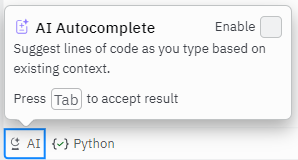
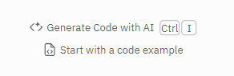
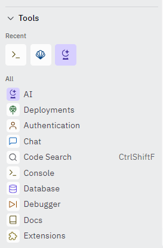
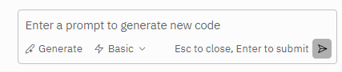

# replit-exam-lock

Hides exam-unfriendly elements of the replit.com editor.

Looks to remove all AI-related features, as well as disable access to the Settings tab to prevent unwanted changes.

### Examples of items removed

- AI Autocomplete

## 

- AI Generate inline prompt

## 

- Tools menu

## 

- AI Generate input

## 

For a complete list, see [elements_to_remove.toml](elements_to_remove.toml)

## Method

Currently elements are simply hidden with an injected stylesheet, due to page issues if certain elements are forcibly deleted.

## Credits

Padlock icon used with permission, created by [Pixel perfect](https://www.flaticon.com/free-icons/lock)
